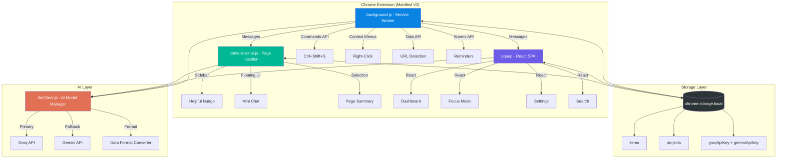
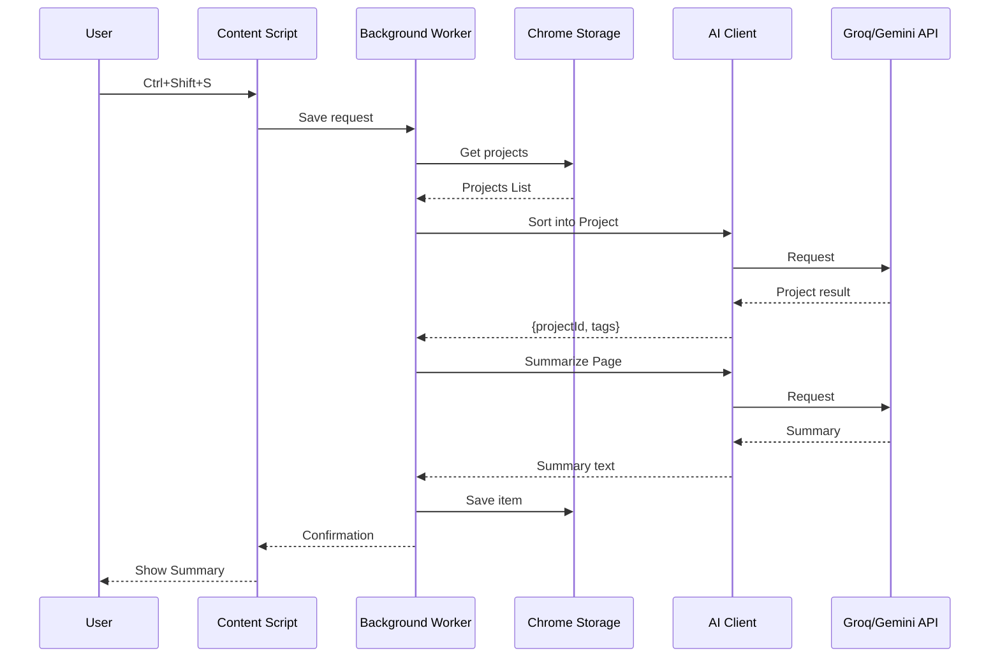
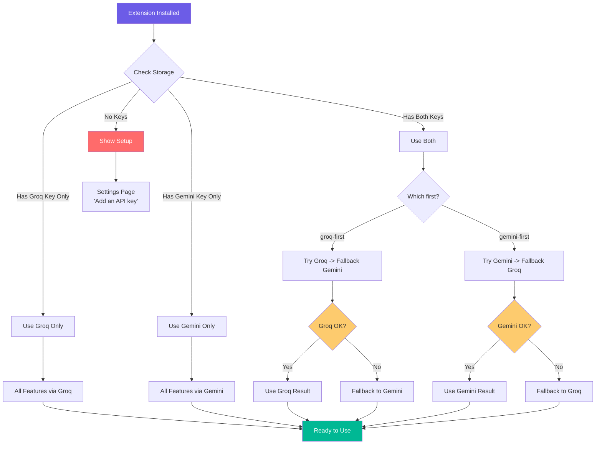
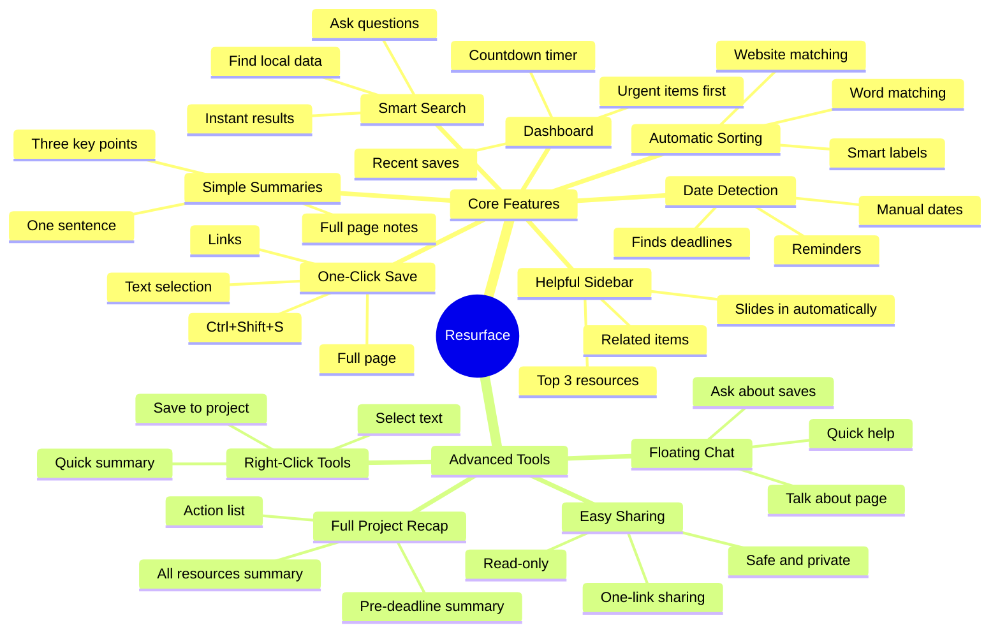
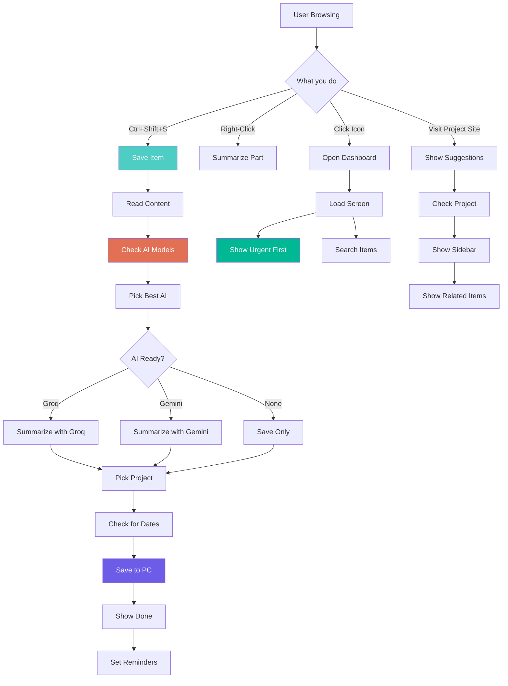

# Resurface: Your Second Brain | Intelligent Knowledge Recall

> **One-Liner:** "Resurface: Save anything. AI sorts and summarizes it. Find it by asking simple questions. It uses two AI models and switches between them automatically to make sure it always works."

---

## Problem Statement

We surf the internet every single day and read tons of study materials, documentation, research papers, and articles. You find something valuable that you know you'll need later. But you don't save it properly, and even if you do, you can't find it at the exact moment you need it. 

That specific piece of information ends up buried under a hundred bookmarks or lost in your browser history.

---

## Solution

Enter **Resurface**, your quiet, reliable second brain. It doesn't just store your information: it brings it back at the exact moment you need it. 

- **One-Click Save:** Just press `Ctrl+Shift+S` and your page is saved instantly. No folders, no naming, no effort.
- **Automatic Sorting & Summaries:** In that same second, AI reads the page, understands what it's about, and writes a short, simple summary for you. It automatically figures out which project it belongs to.
- **Smart Reminder Detection:** If there's a deadline or date mentioned in the text, it spots it and sets a reminder for you.
- **Helpful Sidebar:** Later, when you open a related site (like your code repo or a document), a small sidebar slides in. It says, *"Here are the things you saved for this."* You didn't search. You didn't even have to remember. It just handed it back to you.
- **Search by Asking:** Ask naturally, *"What was that growth stat I saved last week?"* and it answers in seconds.
- **Project Recaps:** Before a big deadline, one click gives you a full summary of everything you've saved for that project: all the key notes and important links in one place.
- **100% Private & Free:** Everything stays on your own computer. Your data, your summaries, and your AI keys: nothing is ever uploaded to a server. You use your own free keys from Groq or Gemini, so it costs you nothing. If one AI is slow, the other takes over automatically. No fees. No privacy worries.

Stop searching. Start building.

---

## Quick Start: Run Resurface Locally

### Prerequisites
- Node.js (v18 or higher)
- npm or yarn
- A Google Gemini or Groq API Key

### Installation

1. **Clone the Repository:**
   ```bash
   git clone https://github.com/MadhavGarg98/Resurface.git
   cd Resurface
   ```

2. **Install Dependencies:**
   ```bash
   npm install
   ```

3. **Build the Extension:**
   ```bash
   npm run build
   ```

4. **Load into Chrome:**
   - Open Chrome and go to `chrome://extensions/`
   - Turn on **Developer mode** (top right toggle).
   - Click **Load unpacked** and select the `dist` folder from the project directory.

---

## Visual Documentation

### Walkthrough Video
[Watch the Resurface Demo (Google Drive)](https://drive.google.com/file/d/1FqJ8Y8tsZH1tvvFpNbVtF-IxauRiHZ1B/view?usp=sharing)

### System Flow in Action

<h4 align="center">Sidebar Screenshot</h4>
<p align="center">
  
</p>

> 1. Helpful Suggestions: While you browse, Resurface shows you things you've already saved that are related to the current page in a clean sidebar.

<h4 align="center">Main Dashboard</h4>
<p align="center">
  
</p>

> 2. Main Dashboard: A clean and simple overview of everything you've saved recently and the projects you're working on.

<h4 align="center">Library | Your Collection</h4>
<p align="center">
  
</p>

> 3. Your Collection: See all your saved items, each with a clear AI summary and smart labels to help you find them easily.

<h4 align="center">Project Space</h4>
<p align="center">
  
</p>

> 4. Projects: Organize your work into different projects to keep your research and learning in order.

<h4 align="center">Creating Project</h4>

<p align="center">
  
</p>

> 5. Creating Projects: Easily set up new projects with AI-suggested words to keep your research organized.

<h4 align="center">Ask Your Data | Your Second Brain Chatbot</h4>

<p align="center">
  
</p>

> 6. Ask Your Data: Ask questions about what you've saved and get instant answers based only on your own collection.*

<h4 align="center">Settings</h4>

<p align="center">
  
</p>

> 7. Settings: Easily manage your AI API keys and customize how the extension works for you.

---

## Technical Stack
- **Frontend:** React + Vite (Manifest V3)
- **Styling:** Tailwind CSS with a clean and distraction-free design
- **AI Integration:** Groq API & Gemini API with automatic fallback
- **Data Saving:** Chrome Storage API (everything stays on your computer)
- **AI Logic:** Simple AI processing for summaries and smart matching

---

## Table of Contents

1. [Problem Statement](#problem-statement)
2. [Solution](#solution)
3. [Quick Start: Run Resurface Locally](#quick-start-run-resurface-locally)
4. [Visual Documentation](#visual-documentation)
5. [Technical Stack](#technical-stack)
6. [Architecture Overview](#architecture-overview)
7. [The 4 Automatic User Scenarios](#the-4-automatic-user-scenarios)
8. [Project Structure](#project-structure)
9. [Data Models](#data-models)
10. [Core Files Deep Dive](#core-files-deep-dive)
11. [Feature Specification](#feature-specification)
12. [User Flow Diagrams](#user-flow-diagrams)
13. [Dependencies](#dependencies)
14. [Implementation Phases](#implementation-phases)
15. [API Integration Details](#api-integration-details)
16. [Demo Script](#demo-script)
17. [Deployment Guide](#deployment-guide)
18. [License](#license)

---

## Architecture Overview



### Component Communication Flow



---

## The 4 Automatic User Scenarios



| User Has | System Behavior | Speed | Reliability |
|:---|:---|:---|:---|
| **Only Groq key** | Uses Groq for everything | Very Fast | Good |
| **Only Gemini key** | Uses Gemini for everything | Fast | Good |
| **Both keys** | Groq first, then Gemini | Fast with fallback | Best |
| **Neither key** | Shows setup: "Add an API key" | N/A | Setup needed |

**No complicated settings. It just works with the keys you provide.**

---

## Project Structure

```
resurface-extension/
│
├── manifest.json                    # Extension settings
├── package.json                     # Project dependencies
├── vite.config.js                   # Build tools settings
├── tailwind.config.js               # Design settings
├── postcss.config.js                # Style processing
├── .gitignore
├── README.md
│
├── public/
│   └── icons/
│       ├── favicon.png              # Main icon
│       └── ...                      # Other sizes
│
├── src/
│   ├── background/                  # Background Worker
│   │   ├── index.js                 # Main entry
│   │   ├── commands.js              # Keyboard shortcut handler
│   │   ├── contextMenus.js          # Right-click menu handler
│   │   ├── tabListener.js           # Page change listener
│   │   ├── alarms.js                # Reminder timer
│   │   └── messageHandler.js        # Communication manager
│   │
│   ├── popup/                       # Main Dashboard (Extension Popup)
│   │   ├── index.html               # Main page
│   │   ├── main.jsx                 # Startup file
│   │   ├── App.jsx                  # Main app layout
│   │   │
│   │   ├── components/
│   │   │   ├── Dashboard.jsx        # Your home screen
│   │   │   ├── FocusMode.jsx        # Urgent items view
│   │   │   ├── ProjectCard.jsx      # Project overview
│   │   │   ├── ResourceItem.jsx     # Saved item view
│   │   │   ├── SearchBar.jsx        # Simple search box
│   │   │   ├── Settings.jsx         # Key management
│   │   │   ├── ApiStatus.jsx        # AI status light
│   │   │   ├── RecapGenerator.jsx   # Project summary tool
│   │   │   ├── SharePanel.jsx       # Simple sharing
│   │   │   ├── Onboarding.jsx       # First-time setup
│   │   │   └── Layout.jsx           # App shell
│   │   │
│   │   └── styles/
│   │       └── index.css            # Styles
│   │
│   ├── content/                     # Browser Page Tools
│   │   ├── contentScript.js         # Main page manager
│   │   ├── floatingChat.js          # Small chat bubble
│   │   ├── sidebarInjector.js       # Helpful sidebar
│   │   └── pageExtractor.js         # Text reader
│   │
│   └── utils/                       # Shared Helpers
│       ├── storage.js               # Local data manager
│       ├── llmClient.js             # AI model manager
│       ├── categorizer.js           # Project sorting logic
│       ├── summarizer.js            # Summary maker
│       ├── deadlineParser.js        # Date finder
│       ├── smartSearch.js           # Smart search logic
│       ├── recapGenerator.js        # Recap tool
│       ├── urlMatcher.js            # URL pattern checker
│       └── constants.js             # Shared settings
│
└── build/                           # Ready-to-use extension
```

---

## Data Models

### Project Organization

```javascript
{
  id: "uuid-v4",                          // ID
  name: "My Project",                     // Name
  description: "A simple project",        // About
  keywords: [                             // Words that trigger this project
    "research",
    "notes"
  ],
  relatedUrls: [                          // Websites that trigger the sidebar
    "github.com/*",
    "docs.google.com/*"
  ],
  deadline: "2025-04-25T23:59:59Z",      // When it's due
  createdAt: "2025-04-01T08:00:00Z",
  color: "#FF6B6B",                       // Theme color
  archived: false,                        // Hidden or visible
  resourceCount: 24                       // Total items in project
}
```

### Saved Item Details

```javascript
{
  id: "uuid-v4",                          // ID
  projectId: "uuid-v4",                   // Project it belongs to
  type: "link" | "text" | "page",         // What it is
  
  // Content
  title: "My Saved Page",                // Name
  url: "https://example.com",             // Website link
  textContent: "The main text...",        // The actual info
  
  // AI-Generated
  summary: "A quick summary...",          // Short summary
  bulletSummary: [                        // 3 key points
    "Point one",
    "Point two",
    "Point three"
  ],
  tags: ["note", "important"],           // Smart labels
  
  // Reminders
  deadlineMentioned: "2025-04-20",        // Found date
  
  // Meta
  accessCount: 7,                         // How many times opened
  lastAccessed: "2024-04-24T14:00:00Z",
  savedAt: "2024-04-22T10:30:00Z",
  readStatus: "unread" | "read",
  
  // AI Provider
  aiProvider: "groq" | "gemini"          // Which AI made the summary
}
```

---

## Core Files Deep Dive

### `utils/llmClient.js`: The AI Manager

```javascript
// Automatically finds your keys and manages the AI models

const GROQ_MODEL = 'llama-3.1-8b-instant';
const GEMINI_MODEL = 'gemini-2.0-flash';

/**
 * AI CALLER: Used by the whole extension
 */
async function callLLM({ messages, maxTokens = 200, temperature = 0.2 }) {
  const providers = await getAvailableProviders();
  
  if (providers.length === 0) {
    throw new Error(
      'No API keys found. Please add one in Settings.'
    );
  }
  
  // Try each AI in order
  for (const provider of providers) {
    try {
      const result = await provider.fn(
        provider.key, messages, maxTokens, temperature
      );
      return { ...result, provider: provider.name };
    } catch (error) {
      console.warn(`[AI] ${provider.name} failed:`, error.message);
      continue; 
    }
  }
  
  throw new Error('All AI models failed. Please check your keys.');
}

/**
 * AUTO DETECTION
 * Finds your keys in local storage
 */
async function getAvailableProviders() {
  const { groqApiKey, geminiApiKey, preferredOrder } = 
    await chrome.storage.local.get(['groqApiKey', 'geminiApiKey', 'preferredOrder']);
  
  const providers = [];
  const order = preferredOrder || 'groq-first';
  
  if (order === 'gemini-first') {
    if (geminiApiKey) providers.push({ name: 'gemini', key: geminiApiKey, fn: callGemini });
    if (groqApiKey) providers.push({ name: 'groq', key: groqApiKey, fn: callGroq });
  } else {
    if (groqApiKey) providers.push({ name: 'groq', key: groqApiKey, fn: callGroq });
    if (geminiApiKey) providers.push({ name: 'gemini', key: geminiApiKey, fn: callGemini });
  }
  
  return providers;
}
```

---

## Feature Specification

### Main Features



---

## User Flow Diagrams

### Primary Flow: Save -> Sort -> Resurface



---

## Dependencies

### Project Tools

- **React**: For the user interface
- **Vite**: For fast building
- **Tailwind CSS**: For clean design
- **Lucide-React**: For simple icons
- **Framer Motion**: For smooth movements

---

## Implementation Phases

### Timeline

- **Phase 1: Foundation**: Setting up the project and basic AI client.
- **Phase 2: Saving**: Building the one-click save and smart summary logic.
- **Phase 3: Dashboard**: Creating the main screen and search tools.
- **Phase 4: Smart Tools**: Adding the sidebar suggestions and floating chat.

---

## API Integration Details

### AI Model Comparison

| Feature | Groq | Gemini |
|:---|:---|:---|
| **Model Used** | Llama 3.1 8B | Gemini 2.0 Flash |
| **Free Tier** | 30 requests/min | 15 requests/min |
| **Speed** | Extremely Fast | Fast |
| **Cost** | Free | Free |

---

## Demo Script

### 2-Minute Flow

1.  **0:00**: Show the mess (too many tabs and bookmarks).
2.  **0:15**: Save a page with one shortcut.
3.  **0:35**: Open the dashboard to see the summary.
4.  **0:50**: Ask a question in the search bar.
5.  **1:05**: Visit a related site and see the sidebar appear.
6.  **1:20**: Use the mini chat for quick help.
7.  **1:40**: Right-click to summarize a specific part.
8.  **1:55**: Click for a full project recap.

---

## Deployment Guide

### Run it on your computer

1.  **Build**: `npm run build`
2.  **Chrome**: Go to `chrome://extensions/`
3.  **Dev Mode**: Turn on "Developer mode".
4.  **Load**: Click "Load unpacked" and pick the `dist` folder.

---

## License
MIT License - Developed for HackIndia 2024.
